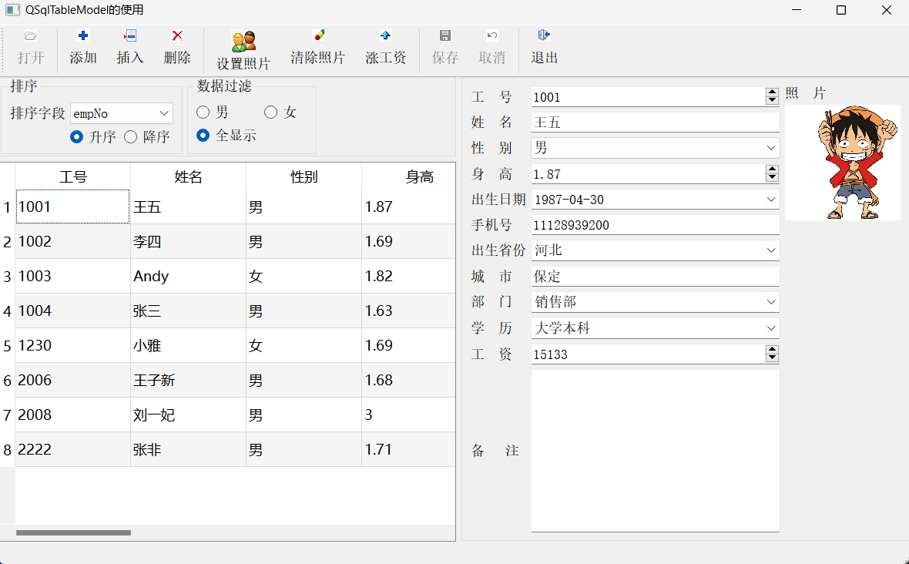
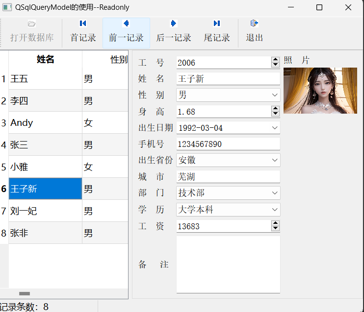
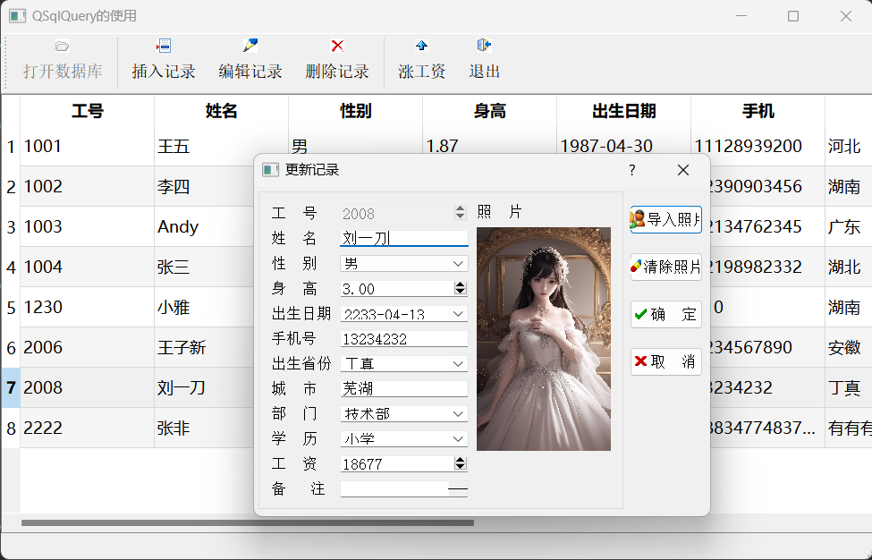
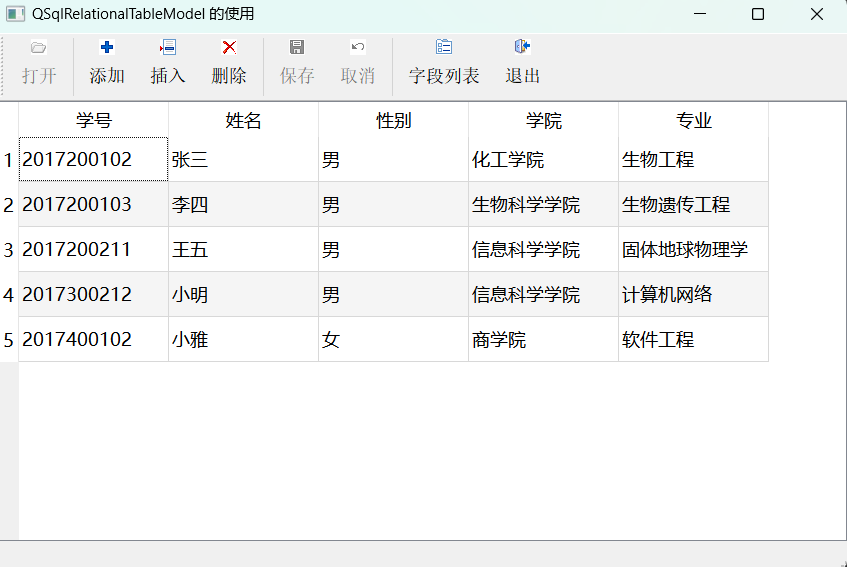

# 1_Table

## 功能

1. 连接`SqlLite`数据库
2. `QSqlTableModel`结合`QTableView`显示数据库
3. `QDataWidgetMapper`数据映射，实现数据到控件的映射
4. 添加、插入、删除表格，修改后更新到`Model`，并且更新到数据库
5. 过滤记录

---

# 2_QueryReadOnly

## 功能

1. `QSqlQueryModel`用法
2. 记录移动，查询移动

---

# 3_QueryEdit

## 功能

1. 使用`select`、`update`、`delete` 更新数据库

---

# 4_Relational

## 功能

1. 关系型数据库`QSqlRelationalTableModel`