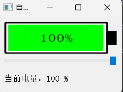
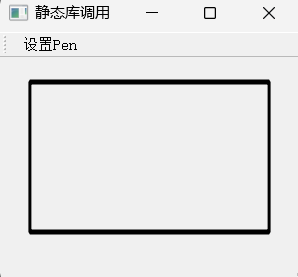

# 1_QmyBattery

## 功能

1. 自定义电池显示控件

2. 使用`paintEvent`重绘控件

   ​                                                                                                                                                                                                                                                                                                                                                                                                                                                                                                                                                                                                                                                                                                                                                                                                                                                                                                                                                                                                                                                                                                                                                                                                                                                                                                                                                   

# 2_DesignerPlugin

## 功能

1. 自定义设计师插件

   > 导出lib后， 需要将动态库放到设计师程序的`plugin`文件夹中，使用时，提供头文件，**插件**的动态库

# 3_staticLib

## 功能

1. 导出静态库并使用

# 4_sharedLib

## 功能

1. 共享动态库

