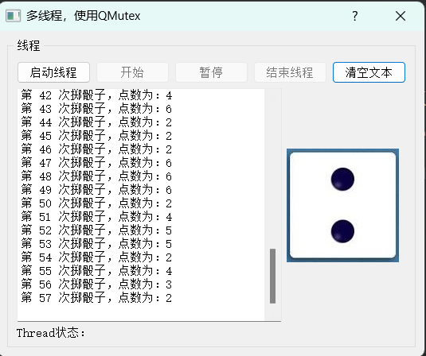
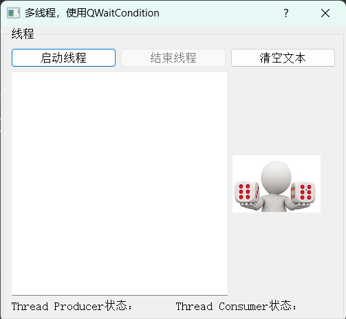

# QThread - dice

## 功能介绍

1. 创建一个**子线程**去生成随机数，并将生成的随机数**传输**给主线程
2. 主线程根据传输过来的随机数，更改图片，并生成提示信息到左边的`QPlainTextEdit`中
3. 按钮控制线程的启动、开始、暂停、结束
4. 使用`QTimer`实现相同的功能

---

# QMutex - dice

## 功能介绍

1. 主线程调用子线程的接口去获取资源，使用互斥锁实现线程同步

---

# QReadWriteLock_dice

## 功能介绍

1. 使用一个生产线程产生随机数，一个线程存储这些数据到磁盘中，一个线程提醒主线程有新的值。使用**`QReadWriteLock` **实现同步

---

# QWaitCondition_dice

## 功能介绍

1. 使用 `QWaitCondition` 实现线程的同步

   > wait（）：必须在已经占有锁的情况下调用，它会释放锁

---

# QSemaphore_dice

## 功能介绍

1. 使用两个`buf`来存储生成的随机数，使用`QSemaphore`管理资源实现线程的同步

