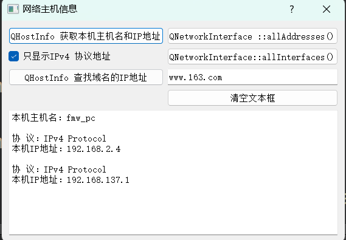
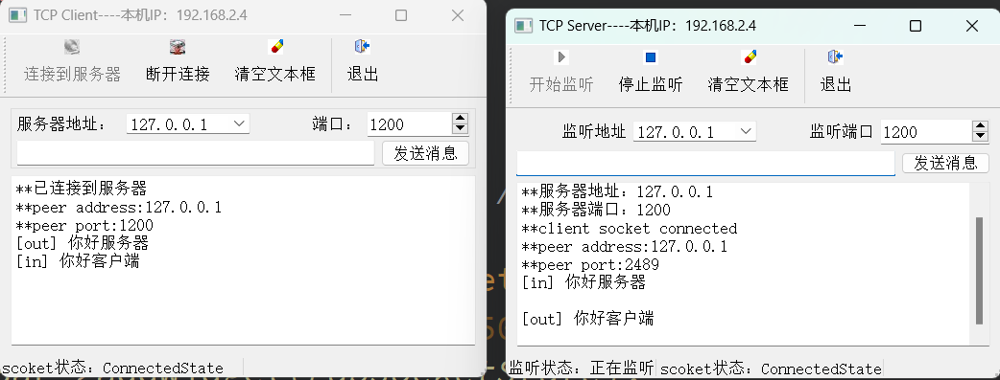
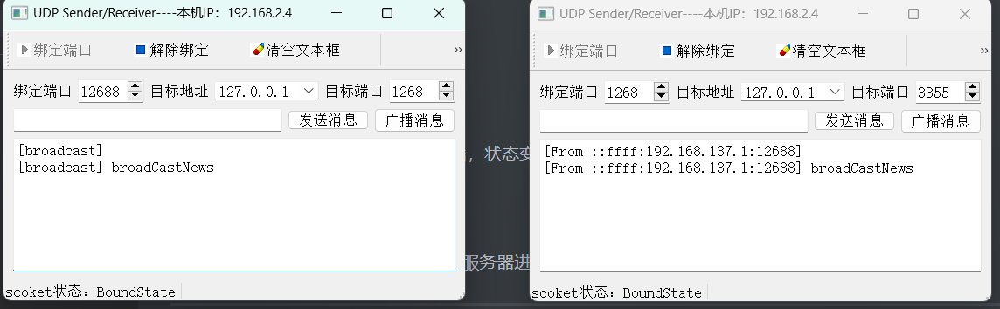
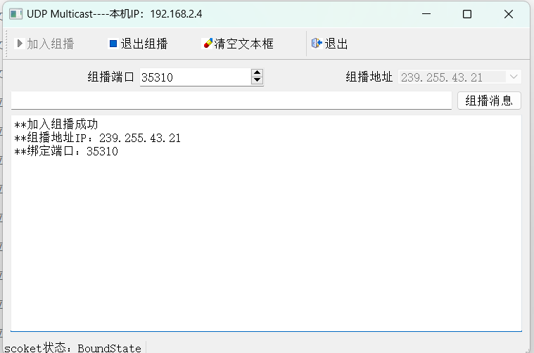
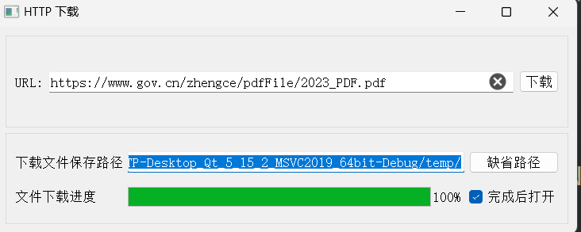
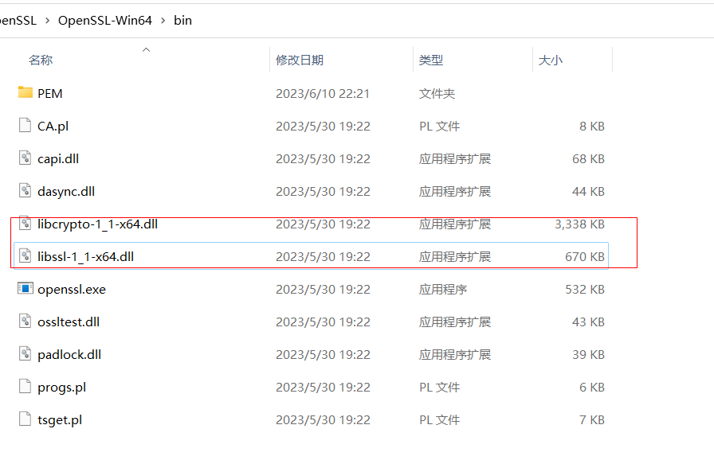

# HostInfo



## 功能介绍

1. 获取本机`ip`地址、名称等信息
2. 通过域名或者主机名，查找主机信息
3. 主要是学习`QHostInfo`和 `QNetWorkInterface`两个类的用法

---

# TCP



## 功能介绍

### 服务端

1. 监听主机的ip地址与端口
2. 创建`TCP`，与服务端进行通信，状态变化响应

### 客户端

1. 创建`Socket`,连接服务器，与服务器进行通信

---

# UDP_Single_Broadcast




## 功能介绍

1. 使用 UDP 实现单播与广播
2. UDP通信接收者与发送者是同一个

---

# UDP_Multicast



## 功能介绍

1. `UDP`实现组播功能

---

# HTTP



## 功能介绍

1. 给定URL下载文件到指定目录
2. 检测下载进度，使用工具条显示
3. 下载完成后，使用默认工具打开文件

## 遇到的问题

> qt.network.ssl: QSslSocket::connectToHostEncrypted: TLS initialization failed

**解决**

1. 查看SSL版本

   ```c++
   QString version = QSslSocket::sslLibraryBuildVersionString();//"OpenSSL 1.1.1g  21 Apr 2020"
   qDebug().nospace()<<__FILE__<<"("<< __LINE__<<")"<<__FUNCTION__ <<" -- " << version;
   bool support = QSslSocket::supportsSsl();
   ```

2. 安装对应版本的软件
3. 将安装过程中的动态库文件复制到``exe`所在的文件夹

​	