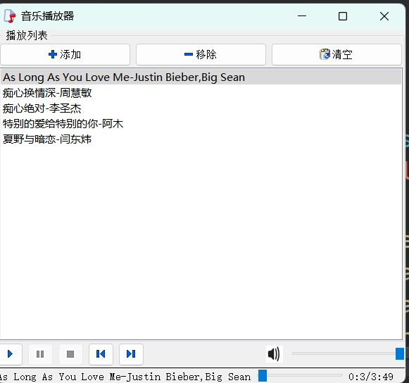
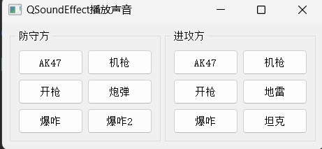
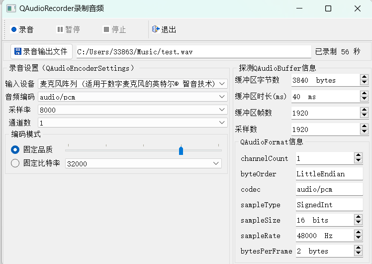
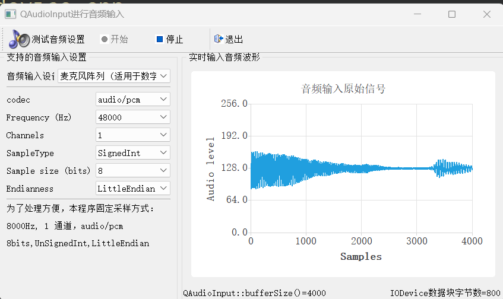

# MediaPlayer

## 功能点

1. 添加`mp3`,`wav`文件，以list形式显示，默认播放第一个文件
2. 移除歌单文件，如果是正在播放的歌曲，切换到上一个歌曲，如果上一个没有，切换到下一首
3. 双击歌名播放
4. 播放、暂停、停止、上一首、下一首，音量控制按钮
5. 播放进度显示，可以手动拖动进度条修改音乐播放进度

---

# SoundEffect

## 功能点

1. `QSoundEffect`、`QSound`播放音频

---

# AudioRecoder

## 功能点

1. 录制音频

---

# AudioInput

## 功能点

1. 