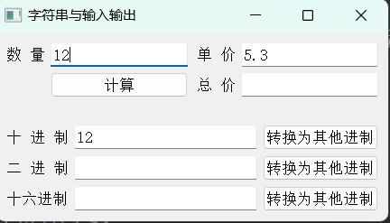
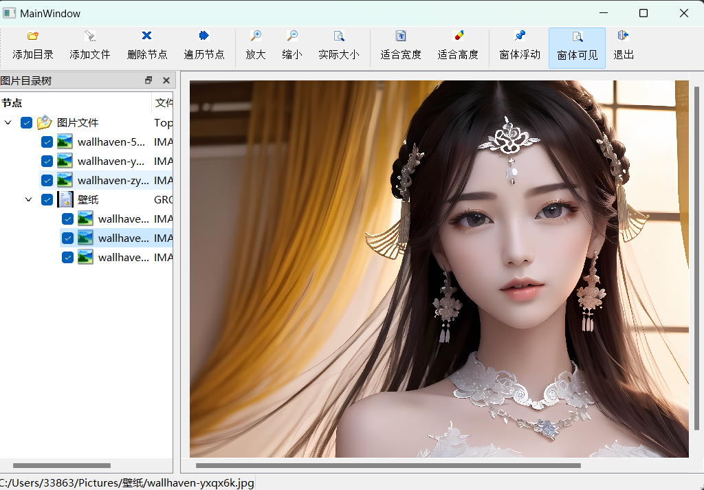
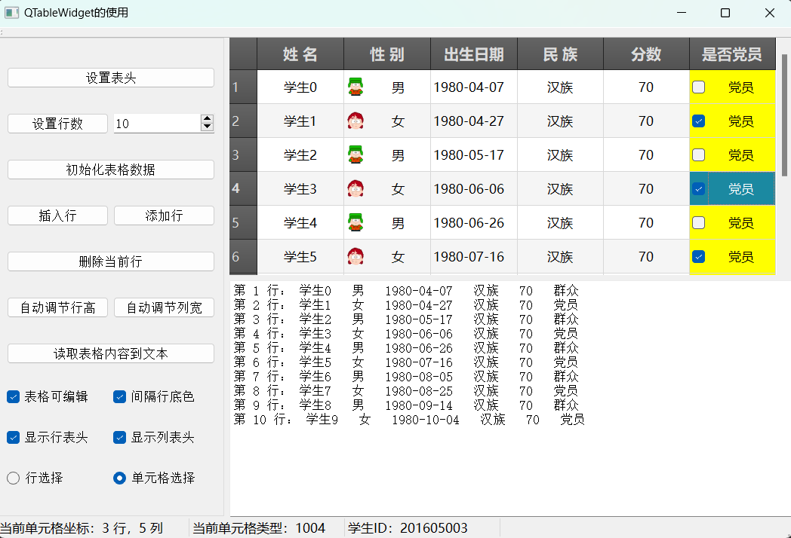

# _Edit




- 练习进制转换接口，以及Qt布局 Body


# _treeWidget



## 功能点

1. 以树结构控制图片的显示
2. 添加目录会添加目录下 所有的`jpg` 图片， 添加文件选择添加的`jpg`图片
3. 删除节点可以删除选中的节点，顶层节点不可删除
4. 遍历实现每秒切换图片，对应的节点跟着切换
5. 显示图片的放大缩小适应高度与宽带要求，窗体可浮动

## 技术点

1. QTreeWidget

   ```c++
       QIcon            icon(":/icons/31.ico");
       QTreeWidgetItem* item = new QTreeWidgetItem(parItem, IMAGE);
       QFileInfo        fileInfo(fileName);
       QString          baseName = fileInfo.fileName();
       item->setIcon(COLITEM, icon);
       item->setText(COLITEM, baseName);
       item->setText(COLITEMTYPE, "IMAGE");
       item->setFlags(Qt::ItemIsSelectable | Qt::ItemIsUserCheckable | Qt::ItemIsEnabled | Qt::ItemIsAutoTristate);
       item->setCheckState(COLITEM, Qt::Checked);
       item->setData(COLITEM, Qt::UserRole, QVariant(fileName));
   ```

   - 定义节点类型

   - 节点列枚举

   - 节点 属性

     ```c++
         item->setFlags(Qt::ItemIsSelectable | Qt::ItemIsUserCheckable | Qt::ItemIsEnabled | Qt::ItemIsAutoTristate);
     // Qt::ItemIsAutoTristate 自动勾选
     ```

   - 节点按照 列 角色存储值

     ```c++
       item->setData(MainWindow::colItem, Qt::UserRole, QVariant(dataStr)); 
     ```

   - 节点遍历  需要递归遍历

2. 文本添加

   ```
   QStringList files = QFileDialog::getOpenFileNames(this, "选择一个或多个文件", "", "Images(*.jpg)");
   QString dir = QFileDialog::getExistingDirectory(this);
   QStringList fileList = aDir.entryList(QStringList("*.jpg"));
   ```

3. `QLabel` 显示图片以及图片的放缩

   ```c++
       int height = ui->scrollArea->height();
       int realH = curPixmap.height();
       pixRatio = qreal(height) / realH;
       QPixmap pix = curPixmap.scaledToHeight(height - 30);
       ui->label->setPixmap(pix);
   ```

4. QTimer 定时器

   - 主线程操作不会影响到定时器

5. QPixmap 缓存类 QPixmapCache用法
   - QPixmapCache::insert(QString, QPixmap)
   - QPixmapCache:find(QString, QPixmap)
   - QPixmap:laod 会默认将pixmap 放到 QPixmapCache 中

---

# _tableWidget




## 功能点

1. 设置 QTableWidget 的表头，行列，设置行的背景交替变化

2. 从文本中读取内容，初始胡QTableWidgetItem

3. 添加、删除插入行

4. 调节

5. 表头可编辑，显示行表头，列表头

6. 选择方式

7. 用 QSpinxBox 的方式设置分数变化

8. QTableWidget 遍历添加文本到QPlainTextEdit

   

