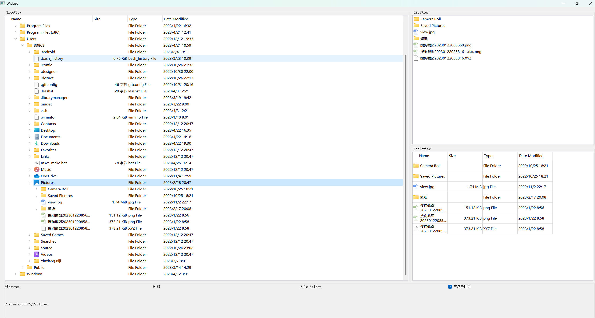
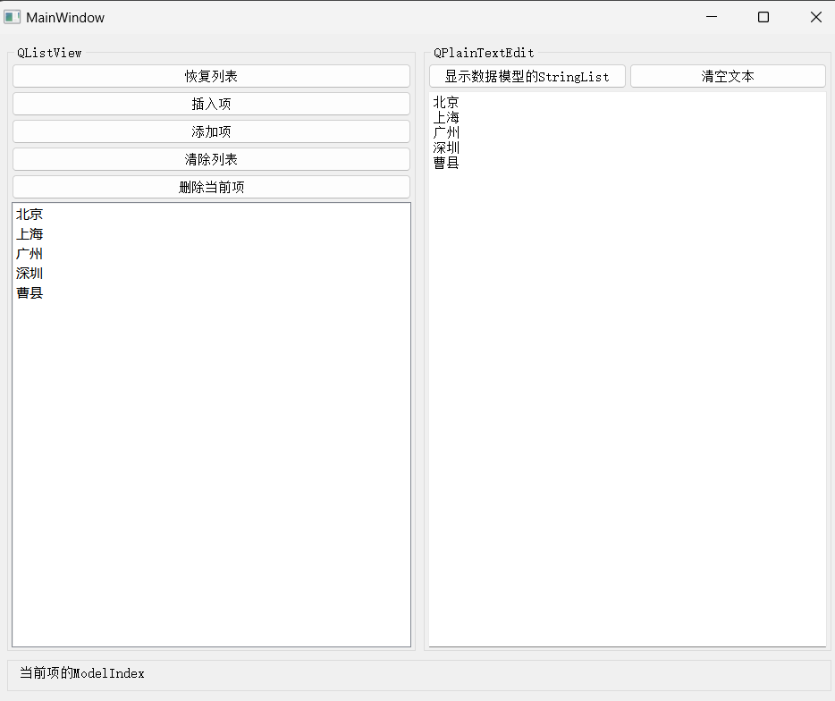
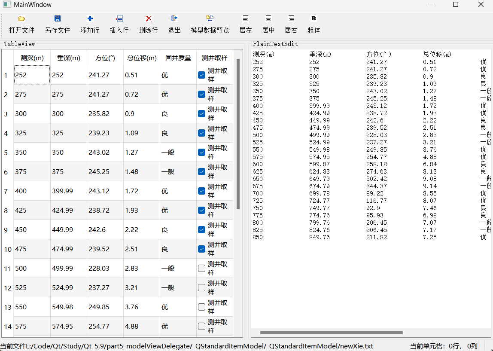
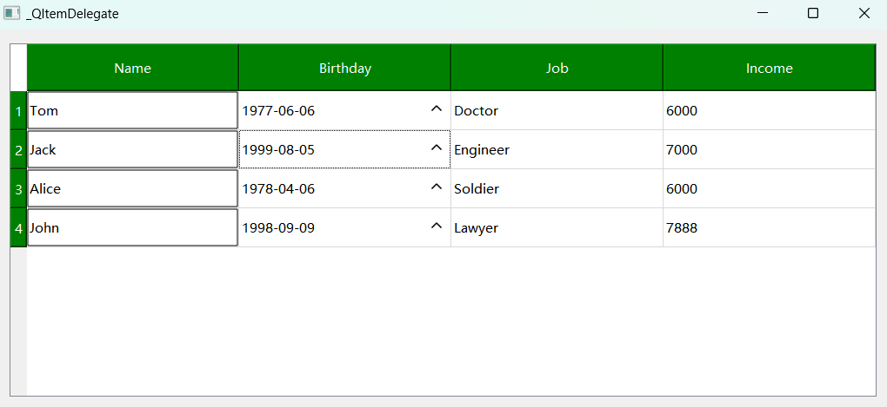

# _QFileSystemModel

## 功能

1. 文件夹QTreeView、QTableView、QListView 显示
2. 判断该节点是否是目录

# _QStringListModel

## 功能

1. 使用ListView 显示 QStringListModel中的数据
2. 初始化 QStringListModel
3. 编辑、添加、删除、插入项
4. 文本显示 model中的数据
5. 状态栏显示

---

# _QStandardItemModel

## 功能

1. 打开一个纯文本文件，该文件是规则的二维数据文件，通过字符串处理获取表头和各行各列的数据，导入一个QStandardItemModel数据模型
2. 编辑修改模型的数据，可以插入行、添加行、删除行，还在`QTableView`视图组件中直接修改单元格的数据内容
3. 可以设置数据模型中某个项的不同角色的数据，不好阔文本对齐方式、字体是否是粗体等
4. 通过`QItemSelectionModel`获取视图组件上得当前单元格，以及选择单元格的范围，对选择的单元格进行操作
5. 将数据模型的数据内容显示到`QPlainTextEdit`组件里，显示数据模型的内容，监视视图组件上得修改是否与数据模型同步
6. 将修改后的数据模型另存为一个文本文件

---

# _QItemDelegate

## 功能点

1. QTableView 使用 代理
2. `Name`列的编辑方式为`QLineEdit`， 选中时显示绿色，编辑框
3. `Birthday`列的编辑方式为 `QDateEdit`， 向上假箭头，表示可以点击
4. `Job`列的编辑方式为`QCombox`
5. `Income`的编辑方式为`QSpinBox`

