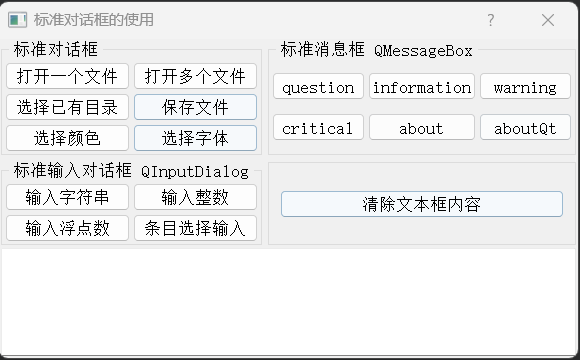
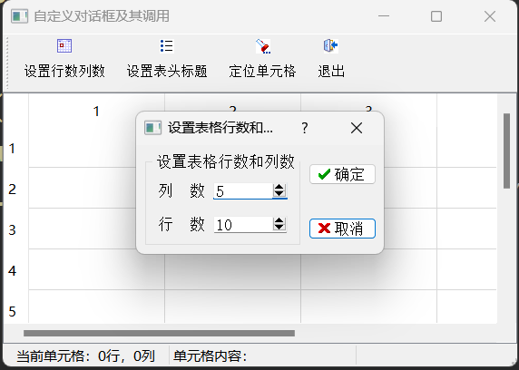
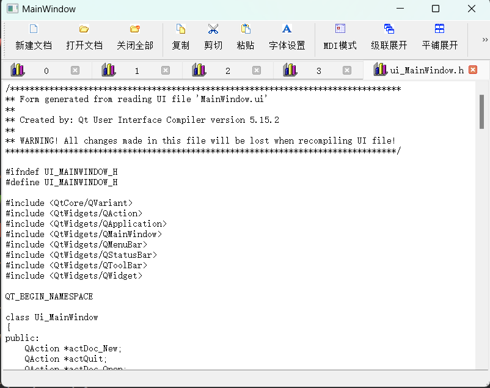
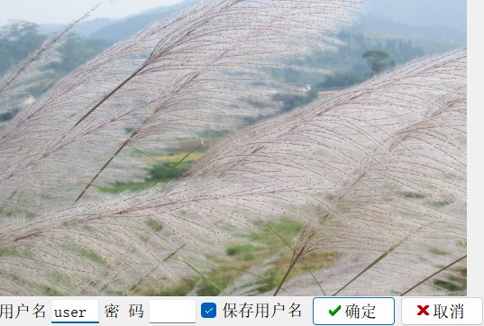

# _StandardDialogs

## 功能

1. 标准对话框
2. 标准输入对话框
3. 标准消息对话框

---

# _CustomDialogs

## 功能

1. 自定义设置表格行数和列数，表头标题，定位单元格对话框

---

# _MultiWindow

## 功能

1. 创建多个嵌入式窗口与非嵌入式窗口（不指定父类窗口）
2. 使用QTabWidget 管理窗口
3. 测试 `QWidget`的属性

---

# _MDI

## 功能

1. MDI 多窗体，级联，平铺展开
2. 安装事件拦截器，阻止 MDI TabBar 鼠标点击切换

# _SplashLogin

## 功能

1. 实现 Splash 特点的无边框对话框
2. 设计鼠标无边框对话框
3. 使用`QSettings`类存储用户名、密码等信息
4. 用`QCryptographicHash`类进行字符串的加密
5. 根据登录输入状况确定启动主窗口或终止程序进行
6. 无边框窗口移动 `move`函数

