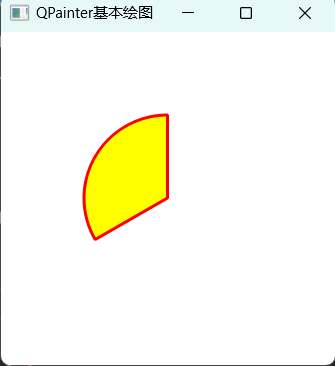
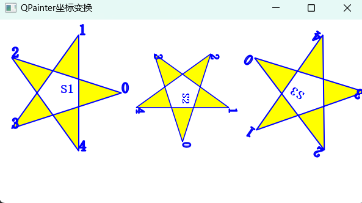
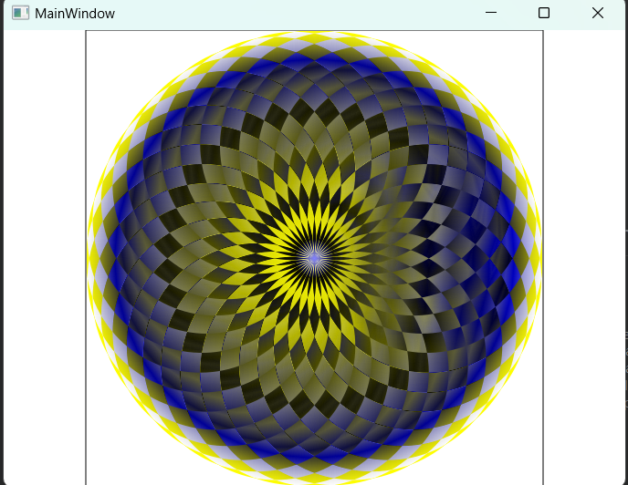
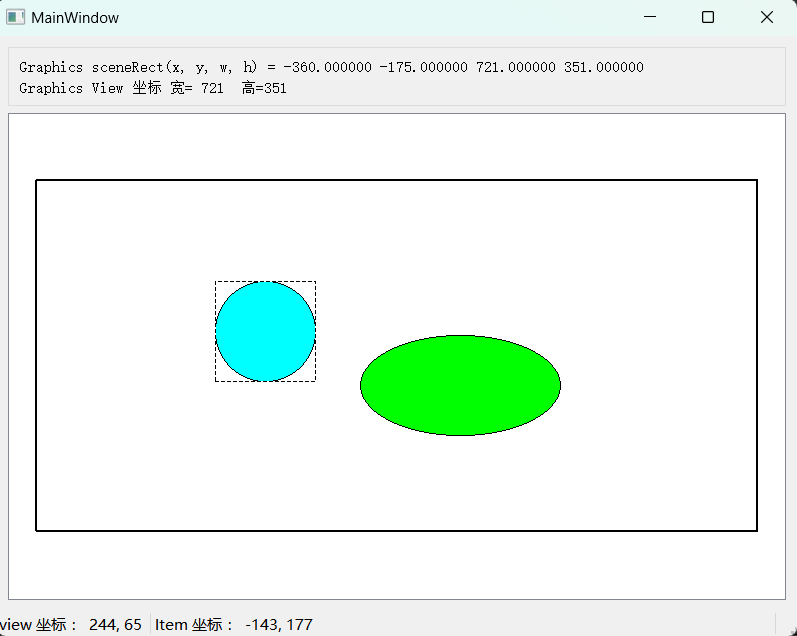
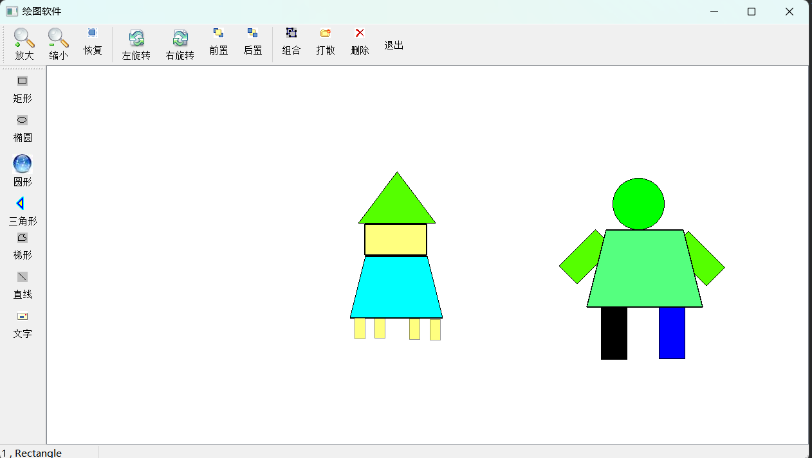

# 1_paintBasic

## 功能：

1. 练习`QPainter`、`QFont`、`QBrush`、`QPen`的各种用法

---

# 2_paintetrPath

## 功能

1. `QPainterPath`用法
2. 坐标旋转，平移，保存与恢复

---

# 3_viewWindow

## 功能

1. 认识`QPainter`的视口与窗口
2. 线性渐变

---

# 4_graphicsView

## 功能

1. 理解`Graphics FrameWork`的三层坐标，以及该框架的基础用法
2. 简单的坐标变换

---

# 5_graphicsViewEdit

## 功能

1. 绘制各种 item
2. 控制 item 放大缩小，旋转，前置后置，以及组合打散

