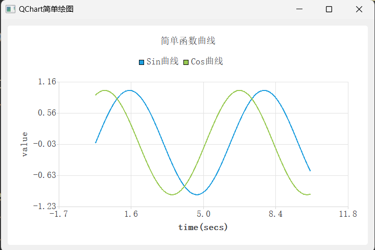
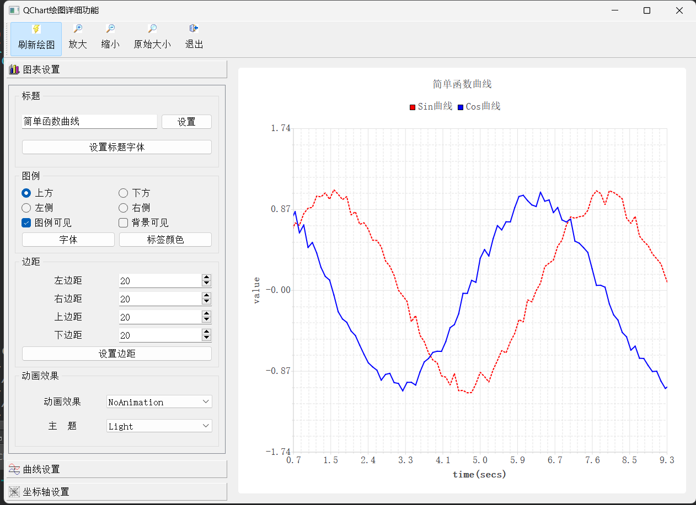
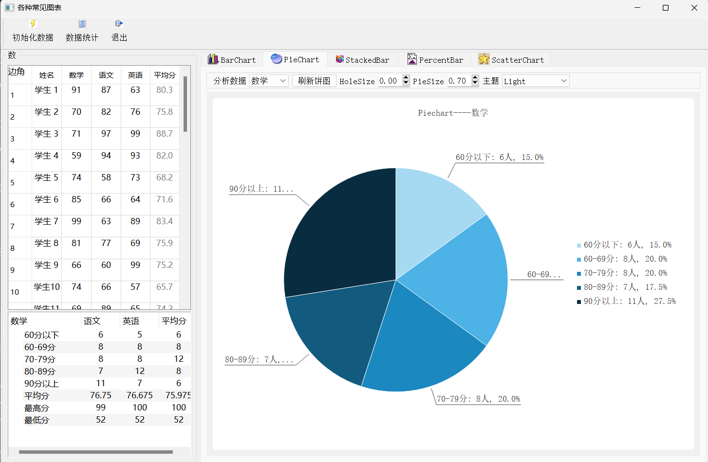
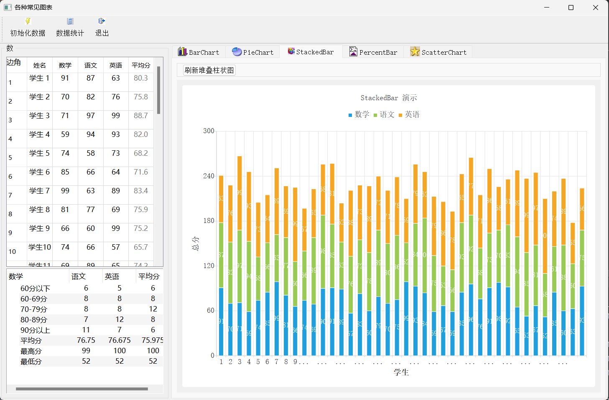
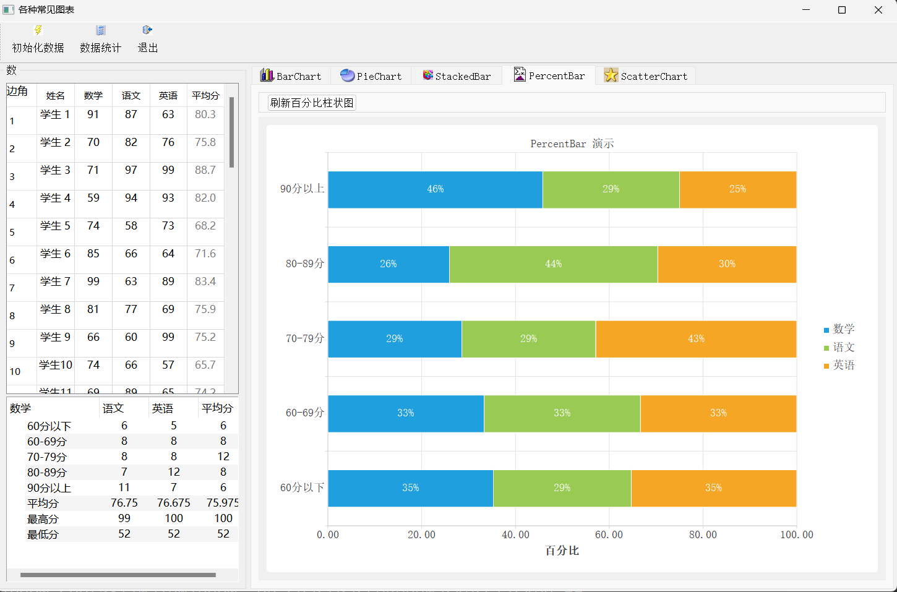
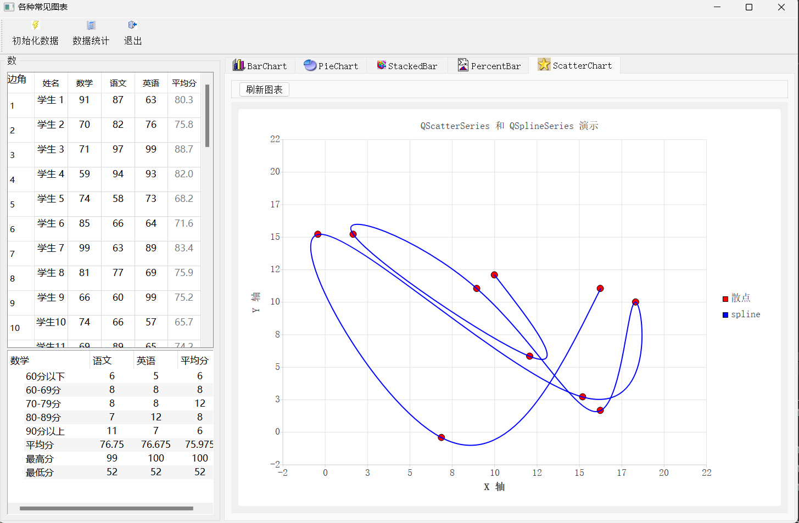
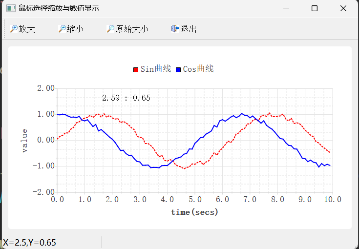

# 1_SimpleChart

## 功能

1. 给定数据绘制图形，绘制坐标，间隔，标题，图例（入门）

---

# 2_ChartConfig

## 功能

1. 图表、曲线、坐标轴基本所有属性与演示

----

# 3_AllCharts

​                                                               								 **柱状图**

​                                                               								 **饼状图**

​                                                               								 **堆叠图**

​		                                                                               	 **百分比柱状图** 

​																			                 **散列图** 

---

# 4_RectZoom

## 功能

1. 缩放曲线
2. 鼠标点击显示数值

